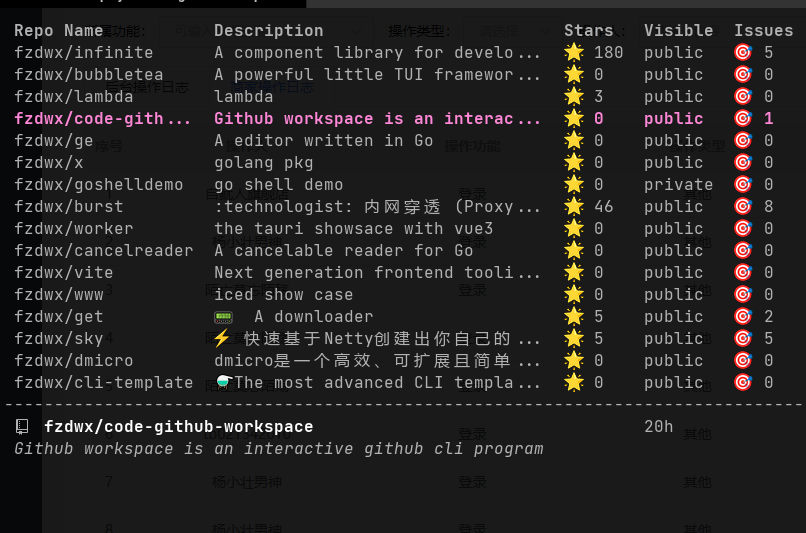

# code-github-workspace
Github workspace is an interactive github cli program

github cli extension




```text
Next Steps
- run 'cd gh-sp; gh extension install .; gh sp' to see your new extension in action
- use 'go build && gh sp' to see changes in your code as you develop
- commit and use 'gh repo create' to share your extension with others

For more information on writing extensions:
https://docs.github.com/github-cli/github-cli/creating-github-cli-extensions
```